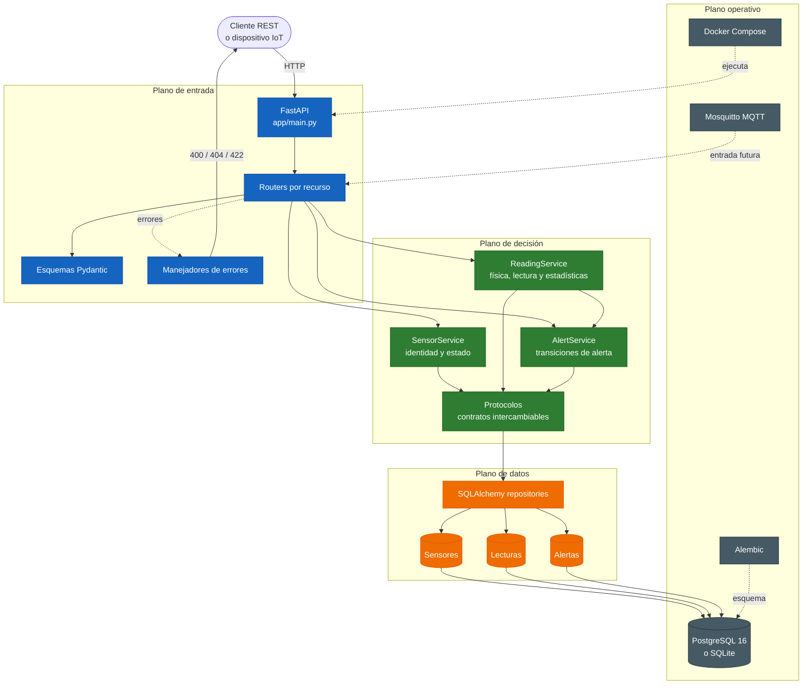
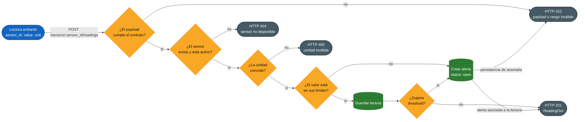

<div align="center">
  
# ESTE SERVICIO SE ENCUENTRA FUERA DE OPERACIÓN.
<br>


# SensorHub API
**De firmware y hardware a una arquitectura de software robusta, escalable y asistida por IA.**


[](https://github.com/lylaxtraw/sdlc-electronica-lyla_alice/actions/workflows/ci.yml)
[](https://github.com/lylaxtraw/sdlc-electronica-lyla_alice/actions/workflows/security.yml)
<br>


<br>


<br>
[](https://sensorhub-api.onrender.com/docs)
[](https://sensorhub-api-odm7.onrender.com/health)
<br>
[](https://www.youtube.com/watch?v=rfcVDUtJq7o)
</div>
<br>

## Tabla de Contenidos

- [SensorHub API](#sensorhub-api)
  - [Tabla de Contenidos](#tabla-de-contenidos)
  - [Sobre el Proyecto](#sobre-el-proyecto)
  - [Características del Sistema](#características-del-sistema)
  - [Stack Tecnológico](#stack-tecnológico)
  - [Arquitectura del Sistema](#arquitectura-del-sistema)
    - [Descripción de las Capas](#descripción-de-las-capas)
  - [Flujo Secuencial de Ingesta y Validación Física](#flujo-secuencial-de-ingesta-y-validación-física)
  - [Estructura del Repositorio](#estructura-del-repositorio)
  - [Reglas de Dominio y Validación Física](#reglas-de-dominio-y-validación-física)
    - [Sensores y Unidades Soportadas](#sensores-y-unidades-soportadas)
    - [Anomalías y Ciclo de Vida de Alertas](#anomalías-y-ciclo-de-vida-de-alertas)
  - [Configuración del Sistema](#configuración-del-sistema)
  - [Endpoints de la API](#endpoints-de-la-api)
    - [Sensores (`/sensors`)](#sensores-sensors)
    - [Lecturas y Telemetría (`/readings`)](#lecturas-y-telemetría-readings)
    - [Estadísticas (`/sensors/{sensor_id}/stats`)](#estadísticas-sensorssensor_idstats)
    - [Alertas (`/alerts`)](#alertas-alerts)
    - [Salud y Observabilidad (`/health`)](#salud-y-observabilidad-health)
  - [Ejemplos de Peticiones HTTP](#ejemplos-de-peticiones-http)
    - [1. Registrar un Sensor de Temperatura (`POST /sensors/`)](#1-registrar-un-sensor-de-temperatura-post-sensors)
    - [2. Ingesta de Lectura Anómala (`POST /sensors/1/readings`)](#2-ingesta-de-lectura-anómala-post-sensors1readings)
    - [3. Consulta de Estadísticas SQL (`GET /sensors/1/stats`)](#3-consulta-de-estadísticas-sql-get-sensors1stats)
  - [Instalación y Configuración Local](#instalación-y-configuración-local)
  - [Ejecución, Docker y CI/CD](#ejecución-docker-y-cicd)
    - [Ejecución Local con Docker Compose](#ejecución-local-con-docker-compose)
    - [Control de Calidad Estática (DoD)](#control-de-calidad-estática-dod)
  - [Observabilidad y Robustez](#observabilidad-y-robustez)
  - [Trazabilidad de Decisiones y Uso de IA](#trazabilidad-de-decisiones-y-uso-de-ia)
  - [Historial de Módulos Previos](#historial-de-módulos-previos)
    - [Semana 1: Driver UART](#semana-1-driver-uart)
    - [Semana 2: IoT Monitoring Core](#semana-2-iot-monitoring-core)


----------

## Sobre el Proyecto

SensorHub es una API RESTful de grado de producción diseñada para la ingesta, validación física en tiempo real y almacenamiento de telemetría proveniente de sensores en bodegas industriales. Este proyecto consolida la transición de conceptos de hardware y electrónica de bajo nivel (programación secuencial bare-metal) a desarrollo de software profesional en la nube, implementando inyección de dependencias (DIP), desarrollo guiado por pruebas (TDD estricto) y automatización con contenedores y pipelines de integración y despliegue continuos.

----------

## Características del Sistema

-   **Gestión de Inventario de Sensores:** Operaciones CRUD completas para la administración de dispositivos de telemetría. La eliminación física de recursos está prohibida; en su lugar, se realiza una desactivación lógica (Soft Delete) del sensor para mantener intacto el histórico de lecturas asociadas.

-   **Ingesta de Lecturas y Telemetría:** Middleware y servicios dedicados a recibir flujos de telemetría en tiempo real. Cada paquete de datos es verificado dinámicamente antes de su persistencia en el motor de base de datos.

-   **Validación de Dominio Física Real:** Sistema tolerante a fallas físicas de hardware. Las lecturas son rechazadas inmediatamente en el router (HTTP 400 o 422) si reportan unidades incorrectas o valores que violen las leyes termodinámicas y límites lógicos de cada sensor (como lecturas de humedad fuera del rango 0-100% o temperaturas inferiores al cero absoluto).

-   **Motor Automático de Anomalías:** Evaluación instantánea de cada lectura recibida contra el umbral operativo seguro (`threshold`) configurado para cada dispositivo. Si el valor supera la barrera segura, se genera automáticamente un registro de incidente con estado inicial abierto (`open`).

-   **Ciclo de Vida de Alertas Incididas:** Máquina de estados estricta y auditable que gestiona la resolución de incidentes de forma transicional: de Abierto (`open`) a Reconocido (`acknowledged`) y finalmente Resuelto (`resolved`).

-   **Motor de Estadísticas Agregadas:** Funciones de agregación eficientes que delegan el procesamiento matemático pesado al servidor SQL, calculando mínimo, máximo y promedio (`min`, `max`, `avg`) por sensor dentro de una ventana de tiempo obligatoria.

-   **Arquitectura Desacoplada y Escalable:** Diseño modular que aplica estrictamente el principio de Inversión de Dependencias (DIP), aislando la lógica de negocio mediante el uso de protocolos y permitiendo probar la aplicación en milisegundos sin depender de infraestructura física de base de datos.


----------

## Stack Tecnológico

| Capa | Tecnologías y herramientas |
| --- | --- |
| **Framework web** | FastAPI, Pydantic v2, Uvicorn |
| **Persistencia** | PostgreSQL 16 (producción), SQLite (local y pruebas), SQLAlchemy 2.0, Alembic |
| **Infraestructura** | Docker, Docker Compose, Render |
| **Calidad y CI/CD** | GitHub Actions, Pytest, Ruff, Mypy, Trivy |
| **Asistencia de IA** | GitHub Copilot, Aider |

----------

## Arquitectura del Sistema

El backend organiza la aplicación en cuatro planos conectados: entrada HTTP, decisión de dominio, persistencia y operación. Esta vista representa cómo se mueve una petición por el sistema y dónde se producen sus efectos, en lugar de describir únicamente una jerarquía de carpetas.



### Descripción de las Capas

-   **Routers (Presentación):** Gestionan las peticiones HTTP mediante FastAPI, validando la estructura del JSON con Pydantic y delegando la lógica al servicio.

-   **Services (Lógica de Negocio):** Es el "cerebro" de la API. Aplica las validaciones físicas y de negocio cruzando información, aislando por completo la lógica del servidor FastAPI.

-   **Repository Protocols (Abstracción):** Interfaces declaradas con `Protocol` que definen los contratos requeridos por el servicio.

-   **SQLAlchemy Repositories (Infraestructura):** Implementaciones concretas que traducen las solicitudes a consultas SQL tipadas con SQLAlchemy 2.x.

-   **Database (Persistencia):** PostgreSQL en producción y SQLite en desarrollo/testing.


----------

## Flujo Secuencial de Ingesta y Validación Física

El registro de una lectura funciona como una cadena de decisión: cada compuerta confirma una condición antes de permitir que el dato avance. La lectura solo se almacena cuando el sensor está activo y el valor respeta su unidad y límites; las alertas se producen como un efecto lateral controlado del mismo proceso.



----------

## Estructura del Repositorio

La API de producción reside de manera aislada en el paquete raíz `app/` para asegurar que las dependencias de despliegue estén limpias de scripts históricos. El árbol incluye los archivos de código, configuración y documentación que deben formar parte del repositorio; se omiten archivos locales o generados como `.venv/`, caches, bytecode, `.DS_Store`, `sensorhub.db` y reportes de cobertura o validación. Asimismo, se incluyen archivos no relacionados con la app por razones de transparencia.

```
Sensorhub_API_RESTful_CherryStraw/
├── .github/
│   ├── ISSUE_TEMPLATE/
│   │   ├── bug.yml                  # Plantilla para reportar errores
│   │   ├── pregunta.yml             # Plantilla para consultas
│   │   ├── propuesta.yml            # Plantilla para propuestas
│   │   └── sugerencia.yml           # Plantilla para sugerencias
│   └── workflows/
│       ├── ci.yml                    # Linter, tipado y pruebas
│       ├── deploy-production.yml     # Despliegue en producción
│       ├── security.yml              # Escaneo de seguridad con Trivy
│       ├── update-ai-log.yml         # Generación automática de AI_LOG.md
│       └── uptime.yml                # Comprobación de disponibilidad
├── app/
│   ├── __init__.py                  # Inicializa el paquete de la aplicación
│   ├── debug/
│   │   └── debug_schemas.py         # Utilidades de depuración de esquemas
│   ├── models/
│   │   ├── __init__.py              # Inicializa el paquete de modelos
│   │   ├── alert.py                 # Modelo ORM de alertas
│   │   ├── reading.py               # Modelo ORM de lecturas
│   │   └── sensor.py                # Modelo ORM de sensores
│   ├── repositories/
│   │   ├── __init__.py              # Inicializa el paquete de repositorios
│   │   ├── alert_repo.py            # Persistencia y consultas de alertas
│   │   ├── reading_repo.py          # Persistencia y estadísticas de lecturas
│   │   └── sensor_repo.py           # Persistencia y consultas de sensores
│   ├── routers/
│   │   ├── __init__.py              # Inicializa el paquete de routers
│   │   ├── alerts.py                # Endpoints REST de alertas
│   │   ├── readings.py              # Endpoints REST de lecturas y estadísticas
│   │   └── sensors.py               # Endpoints REST de sensores
│   ├── schemas/
│   │   ├── __init__.py              # Inicializa el paquete de esquemas
│   │   ├── alert.py                 # Esquemas Pydantic de alertas
│   │   ├── reading.py               # Esquemas Pydantic de lecturas
│   │   └── sensor.py                # Esquemas Pydantic de sensores
│   ├── services/
│   │   ├── __init__.py              # Inicializa el paquete de servicios
│   │   ├── alert_service.py         # Reglas de negocio y ciclo de alertas
│   │   ├── db_alert_service.py      # Servicio de alertas persistidas
│   │   ├── db_alert_strategy.py     # Estrategia de creación de alertas en BD
│   │   ├── errors_service.py        # Excepciones de dominio y servicio
│   │   ├── reading_service.py       # Validación y registro de lecturas
│   │   └── sensor_service.py        # Gestión y reglas de sensores
│   ├── db.py                        # Configuración de base de datos y sesiones
│   └── main.py                      # Aplicación FastAPI y manejadores globales
├── deprecated/                       # Material histórico no desplegable
│   ├── semana0/
│   │   ├── __init__.py
│   │   ├── hola_sensor.py
│   │   └── test_hola_sensor.py
│   ├── semana1/
│   │   ├── jueves/
│   │   │   ├── __init__.py
│   │   │   ├── solid_isp_dip.py
│   │   │   └── test_solid_isp_dip.py
│   │   ├── lunes/
│   │   │   ├── __init__.py
│   │   │   ├── modelos_sensor.py
│   │   │   └── sensor_utils.py
│   │   ├── martes/
│   │   │   ├── __init__.py
│   │   │   ├── fsm_demo.py
│   │   │   └── test_fsm.py
│   │   ├── miercoles/
│   │   │   ├── __init__.py
│   │   │   ├── solid_srp_ocp_lsp.py
│   │   │   └── test_solid_sol.py
│   │   └── uart_driver/
│   │       ├── __init__.py
│   │       ├── config.py
│   │       ├── device.py
│   │       ├── parsers.py
│   │       ├── recorder.py
│   │       └── test/
│   │           ├── __init__.py
│   │           ├── config_test.py
│   │           ├── device_test.py
│   │           ├── parsers_test.py
│   │           └── recorder_test.py
│   └── semana2/
│       ├── eval1/
│       │   ├── __init__.py
│       │   ├── alerts.py
│       │   ├── detector.py
│       │   ├── models.py
│       │   ├── registry.py
│       │   ├── test_alerts.py
│       │   ├── test_detector.py
│       │   └── test_registry.py
│       ├── __init__.py
│       ├── backlog.md
│       ├── DEFINITION_OF_DONE.md
│       ├── RETROSPECTIVE.md
│       └── SPRINT_PLANNING.md
├── docs/
│   ├── adr/
│   │   ├── 0001-arquitectura-en-capas.md # ADR de arquitectura en capas
│   │   └── 0002-patch-sobre-put.md       # ADR sobre PATCH frente a PUT
│   ├── ai_logs/
│   │   ├── Semana0.md                # Registro de trabajo de la semana 0
│   │   ├── Semana1.md                # Registro de trabajo de la semana 1
│   │   ├── Semana2.md                # Registro de trabajo de la semana 2
│   │   ├── Semana3.md                # Registro de trabajo de la semana 3
│   │   ├── Semana4.md                # Registro de trabajo de la semana 4
│   │   ├── Semana5.md                # Registro de trabajo de la semana 5
│   │   ├── Semana6.md                # Registro de trabajo de la semana 6
│   │   ├── Copilot.md                # Conversaciones y decisiones con Copilot
│   │   └── Gemini.md                  # Registro reservado para conversaciones con Gemini
│   └── logo.jpg                       # Logo del proyecto
├── migrations/
│   ├── versions/
│   │   ├── 6c2f4a9b7d10_completar_esquema_de_modelos.py # Completa el esquema ORM
│   │   ├── ad3f3d91ac12_esquema_inicial_completo_para_produccion.py # Crea el esquema inicial
│   │   └── b7e8f9a0c1d2_add_status_to_existing_alerts.py # Añade estados a las alertas
│   ├── README                         # Documentación de Alembic
│   ├── env.py                         # Entorno de ejecución de migraciones
│   └── script.py.mako                 # Plantilla de nuevas migraciones
├── mosquitto/
│   └── config/
│       └── mosquitto.conf             # Configuración del broker MQTT
├── semana5/
│   ├── __init__.py                    # Inicializa el módulo de la semana 5
│   ├── AI_CODE_REVIEW.md              # Revisión de código asistida por IA
│   ├── conversions.py                 # Ejercicios de conversiones
│   └── prompting.md                   # Notas sobre prompts y trabajo con IA
├── tests/
│   ├── __init__.py                    # Inicializa el paquete de pruebas
│   ├── test_alert_repo.py             # Pruebas del repositorio de alertas
│   ├── test_alerts.py                 # Pruebas de endpoints y servicios de alertas
│   ├── test_api.py                    # Pruebas generales de la API
│   ├── test_conversions.py            # Pruebas de conversiones
│   ├── test_db.py                     # Pruebas de configuración de base de datos
│   ├── test_readings.py               # Pruebas de lecturas y telemetría
│   ├── test_repositories.py           # Pruebas de repositorios
│   └── test_services.py               # Pruebas de servicios de negocio
├── .dockerignore                      # Archivos excluidos de la imagen Docker
├── .gitignore                         # Archivos excluidos del control de versiones
├── AI_LOG.md                          # Bitácora principal de uso de IA
├── Dockerfile                         # Imagen de la aplicación
├── README.md                          # Documentación principal del proyecto
├── alembic.ini                        # Configuración de Alembic
├── backlog.md                         # Backlog actual del proyecto
├── course_backlog.md                  # Backlog general del curso
├── docker-compose.yml                 # Servicios locales de API, BD y MQTT
├── pyproject.toml                     # Configuración de herramientas Python
├── render.yaml                        # Configuración de despliegue en Render
├── requirements.txt                   # Dependencias de Python
└── Python 3.14                       # Archivo de referencia del entorno Python

```

----------

## Reglas de Dominio y Validación Física

### Sensores y Unidades Soportadas

1.  **Temperatura (`TEMPERATURE`):**

    -   Unidad de medida física permitida: `C` (Celsius).

    -   Límite absoluto de protección: No se admiten lecturas inferiores al cero absoluto (`-273.15 C`).

    -   Validación: El valor medido debe encontrarse de forma inclusiva entre el `min_value` y el `max_value` configurados específicamente para cada sensor.

2.  **Humedad (`HUMIDITY`):**

    -   Unidad de medida física permitida: `%` (Porcentaje de Humedad Relativa).

    -   Límites de operación física innegociables: Rango estrictamente delimitado entre `0.0` y `100.0` %.

    -   Validación: Cualquier lectura fuera de la frontera física es rechazada con un código HTTP 400 o 422, actuando como un circuito de protección de hardware en software.


### Anomalías y Ciclo de Vida de Alertas

-   **Detección Automática:** Al registrar una lectura que supere el límite operativo seguro (`threshold`) configurado para ese sensor, el sistema creará un registro en la tabla de alertas (`alerts`) con el estado `open`.

-   **Transiciones de Estado de Alerta:** El estado de las alertas solo puede avanzar bajo el siguiente orden lógico inalterable:

    ```
    open (Abierto) -> acknowledged (Reconocido) -> resolved (Resuelto)

    ```

    Un intento de revertir el estado (ej: pasar de `resolved` a `open`) será rechazado inmediatamente por el validador de la API (HTTP 400).


----------

## Configuración del Sistema

La aplicación lee la configuración desde variables de entorno. Si no se define `DATABASE_URL`, utiliza SQLite con el archivo local `sensorhub.db`. Para el entorno de Docker Compose, la URL se configura automáticamente para conectarse al servicio `db`.

| Variable | Descripción | Valor predeterminado o ejemplo |
| --- | --- | --- |
| `DATABASE_URL` | Cadena de conexión de SQLAlchemy. | `sqlite:///sensorhub.db` o `postgresql+psycopg://sensor_user:supersecretpassword@db:5432/sensor_db` |
| `POSTGRES_USER` | Usuario de PostgreSQL usado por Docker Compose. | `sensor_user` |
| `POSTGRES_PASSWORD` | Contraseña de PostgreSQL usada por Docker Compose. | `supersecretpassword` |
| `POSTGRES_DB` | Nombre de la base de datos usada por Docker Compose. | `sensor_db` |

En producción, define estos valores en el proveedor de despliegue y sustituye las credenciales de ejemplo por secretos seguros. El archivo `.env` no debe versionarse.

----------

## Endpoints de la API

La API cuenta con documentación interactiva integrada en la ruta `/docs`. A continuación, se detallan los recursos principales expuestos por el servidor:

### Sensores (`/sensors`)

-   `POST /sensors/` - Registra un nuevo sensor con límites físicos y umbrales de alerta.

-   `GET /sensors/` - Lista todos los sensores activos. Admite paginación (`limit`, `offset`) y filtros dinámicos por `region`, `name` y `last_error`.

-   `GET /sensors/{sensor_id}` - Obtiene los detalles de un sensor por su ID.

-   `PATCH /sensors/{sensor_id}` - Actualiza parcialmente los datos de un sensor (ADR 0002).

-   `DELETE /sensors/{sensor_id}` - Ejecuta la desactivación lógica (Soft Delete) del sensor.


### Lecturas y Telemetría (`/readings`)

-   `POST /sensors/{sensor_id}/readings` - Registra una lectura validando que el valor sea físicamente posible para ese sensor.

-   `GET /sensors/{sensor_id}/readings` - Recupera el historial de lecturas de un sensor con filtros de fecha (`from`, `to`) y paginación.

-   `GET /readings/` - Búsqueda avanzada y global de lecturas de toda la planta, cruzando datos de los sensores.


### Estadísticas (`/sensors/{sensor_id}/stats`)

-   `GET /sensors/{sensor_id}/stats` - Ejecuta funciones de agregación en SQL para calcular mínimo, máximo y promedio (`min`, `max`, `avg`) del sensor en un periodo determinado.


### Alertas (`/alerts`)

-   `GET /alerts/` - Biblioteca general para consultar el historial de alarmas de la infraestructura.

-   `GET /sensors/{sensor_id}/alerts` - Obtiene las alarmas específicas de un sensor.

-   `GET /alerts/sensors-by-alarm` - Busca sensores únicos que hayan disparado un tipo de alarma en una ventana reciente de tiempo (últimas X horas).

-   `PATCH /alerts/{alert_id}` - Cambia de forma segura el estado de resolución de una alerta.


### Salud y Observabilidad (`/health`)

-   `GET /health` - Smoke test activo: realiza una consulta rápida (`SELECT 1`) en base de datos y reporta el uptime del contenedor y las métricas acumuladas.


----------

## Ejemplos de Peticiones HTTP

### 1. Registrar un Sensor de Temperatura (`POST /sensors/`)

-   **Petición:**

    ```
    POST /sensors/ HTTP/1.1
    Host: localhost:8000
    Content-Type: application/json

    {
      "name": "Termómetro Bodega Industrial A",
      "location": "Pasillo 4",
      "region": "Bodega Fría 1",
      "type": "TEMPERATURE",
      "unit": "C",
      "min_value": -50.0,
      "max_value": 100.0,
      "threshold": 35.0
    }

    ```

-   **Respuesta Esperada (201 Created):**

    ```
    {
      "id": 1,
      "name": "Termómetro Bodega Industrial A",
      "location": "Pasillo 4",
      "region": "Bodega Fría 1",
      "type": "TEMPERATURE",
      "unit": "C",
      "min_value": -50.0,
      "max_value": 100.0,
      "threshold": 35.0,
      "last_error": null,
      "is_active": true
    }

    ```


### 2. Ingesta de Lectura Anómala (`POST /sensors/1/readings`)

-   **Petición:**

    ```
    POST /sensors/1/readings HTTP/1.1
    Host: localhost:8000
    Content-Type: application/json

    {
      "value": 42.5,
      "unit": "C"
    }

    ```

-   **Respuesta Esperada (201 Created) [Detonará Alerta Abierta]:**

    ```
    {
      "id": 105,
      "sensor_id": 1,
      "value": 42.5,
      "unit": "C",
      "created_at": "2026-08-22T16:52:10Z",
      "is_anomalous": true
    }

    ```


### 3. Consulta de Estadísticas SQL (`GET /sensors/1/stats`)

-   **Petición:**

    ```
    GET /sensors/1/stats?from=2026-08-22T00:00:00Z&to=2026-08-22T23:59:59Z HTTP/1.1
    Host: localhost:8000

    ```

-   **Respuesta Esperada (200 OK):**

    ```
    {
      "min": 15.2,
      "max": 42.5,
      "avg": 24.87
    }

    ```


----------

## Instalación y Configuración Local

Sigue estos pasos en tu terminal para levantar el entorno de desarrollo y calidad localmente:

1.  **Aislar el entorno virtual de Python:**

    ```
    python3 -m venv .venv

    ```

2.  **Activar el entorno virtual:**

    -   En macOS y Linux:

        ```
        source .venv/bin/activate

        ```

    -   En Windows (Git Bash):

        ```
        source .venv/Scripts/activate

        ```

3.  **Instalar el catálogo de dependencias curadas:**

    ```
    pip install -r requirements.txt

    ```


----------

## Ejecución, Docker y CI/CD

El sistema está empaquetado para garantizar un comportamiento idéntico entre desarrollo y producción.

### Ejecución Local con Docker Compose

Puedes levantar el servidor de FastAPI y la base de datos relacional PostgreSQL con un solo comando:

```
docker compose up --build

```

El pipeline de inicio ejecutará automáticamente las migraciones con Alembic (`alembic upgrade head`) antes de levantar el servidor web Uvicorn.

### Control de Calidad Estática (DoD)

Para garantizar el estándar de la Definition of Done antes de realizar un commit, corre la trilogía de validaciones en la raíz:

```
ruff check .        # 1. Linting y orden de importaciones
mypy app            # 2. Tipado estricto
pytest --cov=app    # 3. Pruebas y cobertura de código

```

### Despliegue de una versión en Render

El despliegue de producción se ejecuta únicamente al publicar un tag con formato semántico `vX.Y.Z`, después de integrar los cambios en `main` mediante un Pull Request aprobado:

```bash
git checkout main
git pull origin main
git tag v1.2.3
git push origin v1.2.3
```

El workflow `deploy-production.yml` valida el formato del tag, comprueba que el commit pertenece a `main` y activa Render mediante `RENDER_DEPLOY_HOOK_URL`. Este secreto debe estar configurado en GitHub Actions.

----------

## Observabilidad y Robustez

-   **Manejo Centralizado de Excepciones:** La API cuenta con manejadores de excepciones globales (`app/main.py`) para capturar las excepciones puras de la capa de servicio y traducirlas a códigos de estado HTTP semánticos (400, 404, 409, 422), previniendo fugas de información de base de datos hacia el cliente.

-   **Métricas y Salud Activa:** Al consultar `/health`, la API no se limita a responder un JSON estático; realiza una verificación de persistencia transaccional rápida (`SELECT 1`) en PostgreSQL y reporta las métricas acumuladas de lecturas, sensores y el uptime del contenedor.

-   **Logs Estructurados:** En producción, se desactivan los prints de consola convencionales y se activa el logger estándar en formato estructurado JSON, facilitando la ingesta de alertas y auditorías en sistemas cloud.


----------

## Trazabilidad de Decisiones y Uso de IA

-   **ADR 0001: Arquitectura en capas para SensorHub:**  [docs/adr/0001-arquitectura-en-capas.md](docs/adr/0001-arquitectura-en-capas.md)
    _Justifica el diseño basado en 4 capas estrictas con Inversión de Dependencias (DIP) mediante interfaces Protocol, permitiendo desacoplar la persistencia y habilitar pruebas en memoria._

-   **ADR 0002: Uso de PATCH vs PUT para actualizaciones de sensores:**  [docs/adr/0002-patch-sobre-put.md](docs/adr/0002-patch-sobre-put.md)
    _Justifica el uso del método PATCH en dispositivos de bajo consumo IoT en redes industriales, evitando la ineficiencia de descargar y reenviar payloads completos obligados por el método PUT._

-   **Bitácora de IA (`AI_LOG.md`):**  [AI_LOG.md](AI_LOG.md)
    _Registro lineal e inmutable de todas las prompts dadas a las IAs (Gemini y Aider), documentando con total transparencia los casos donde se aceptaron o rechazaron sugerencias por razones de ingeniería._


----------

## Historial de Módulos Previos

### Semana 1: Driver UART

Este módulo contiene la reimplementación de un driver UART de estilo embebido (tradicionalmente procedural, acoplado y dependiente de estados globales en C) transformado en una arquitectura modular, orientada a objetos y estrictamente tipada en Python moderno.

-   **config.py (SRP):** Clase `UartConfig` inmutable (`frozen=True`) para validar parámetros de conexión.

-   **parsers.py (OCP/LSP/ISP):** Mensajes abstractos y analizadores concretos (`ModbusParser` y `NMEAParser`) para procesar tramas.

-   **device.py (DIP):**  `UartDevice` que recibe la configuración e inyección de parsers por constructor.

-   **recorder.py (SRP):** Persistencia en formato JSON-lines (`.jsonl`).


### Semana 2: IoT Monitoring Core

Este módulo marca la transición de un flujo de trabajo de "superloop" hacia un ciclo de vida de desarrollo de software (SDLC) profesional. Se implementó el núcleo de un sistema de monitoreo para una bodega industrial utilizando Desarrollo Guiado por Pruebas (TDD) estricto y metodologías ágiles (Scrum, tableros Kanban, etc.), logrando una cobertura del 99% en las clases núcleo.
