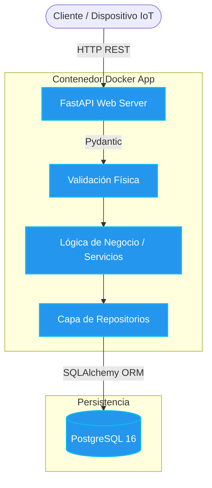

<div align="center">


	
# SensorHub API
*De firmware y hardware a una arquitectura de software robusta, escalable y asistida por IA.*

[](https://github.com/lylaxtraw/sdlc-electronica-lyla_alice/actions/workflows/ci.yml)
[](https://github.com/lylaxtraw/sdlc-electronica-lyla_alice/actions/workflows/security.yml)
<br>


<br>


<br>
[](https://sensorhub-api.onrender.com/docs)
[](https://sensorhub-api-odm7.onrender.com/health)

</div>
<br>

## Tabla de Contenidos
- [Sobre el Proyecto](#-about)
- [Stack Tecnológico](#-stack-tecnológico)
- [Arquitectura del Sistema](#-arquitectura-del-sistema)
- [Instalación y Configuración del Entorno](#-instalación-y-configuración-del-entorno)
- [Ejecución, Docker y CI/CD](#-ejecución-docker-y-cicd)
- [IA, Aider y Calidad Nivel Producción](#-semana-5-ia-aider-y-calidad-nivel-producción)
- [Documentación de la API en Producción](#-documentación-de-la-api-en-producción)

---
## About
SensorHub es una API RESTful diseñada bajo los principios de Arquitectura en Capas (Routers, Servicios, Repositorios y Modelos). Este proyecto marca la transición de conceptos de hardware y electrónica a desarrollo de software profesional, aplicando inyección de dependencias (DIP), validaciones estrictas (TDD) y despliegue automatizado.
## Stack Tecnológico
| Capa | Techs|
| :--- | :--- |
| **Framework Web** | FastAPI, Pydantic, Uvicorn |
| **Persistencia** | PostgreSQL 16, SQLAlchemy 2.0 (ORM), Alembic (Migraciones) |
| **Infraestructura** | Docker, Docker Compose, Render (CD) |
| **Calidad y CI/CD** | GitHub Actions, Pytest, Ruff, Mypy, Trivy (Seguridad) |
| **Asistencia IA** | GitHub Copilot, Aider (LLM en terminal con trazabilidad Git) |
---
## Arquitectura del Sistema
Para visualizar cómo interactúan las 4 capas de la API con Docker y la persistencia de datos, use este mapa visual del sistema:

---
## Instalación y Configuración del Entorno
Para configurar el entorno de desarrollo local (sin Docker) y garantizar el aislamiento de las dependencias, sigue estos pasos desde la raíz del repositorio:
1. Crear el entorno virtual aislado:
	```bash 
	python3  -m  venv  .venv
	 ```
2. Activar el entorno virtual:
	* En macOS y Linux:
		```bash 
		source .venv/bin/activate
		```
	* En Windows (Git Bash / WSL):
		 ```bash
		 source .venv/Scripts/activate
		 ```
## Instalar las dependencias de desarrollo y producción:
```bash
pip install requirements.txt
```
## Ejecución, Docker y CI/CD
El proyecto implementa un flujo de CI/CD automatizado, pero también puede correr localmente replicando con exactitud el entorno de producción mediante un Dockerfile Multi-stage (imagen slim < 200MB).
**Ejecución Local con Docker Compose:**
Para levantar la API junto con la base de datos PostgreSQL 16 utilizando un solo comando:
```bash
docker compose up --build
```
La API estará disponible de inmediato en:
* **Documentación Interactiva (Swagger):** http://localhost:8000/docs
* **Health Check:** http://localhost:8000/health
## Auditoría Estática
La calidad del código se verifica localmente y de manera centralizada en el Pipeline (GitHub Actions). Antes de cada push, el sistema exige:
```bash
ruff check # 1. Linting y ausencia de errores sintácticos
mypy # 2. Tipado estricto verificable
pytest # 3. Pruebas unitarias y de integración
```
## IA, Aider y Calidad Nivel Producción

Durante la última etapa del proyecto, el desarrollo fue potenciado y auditado utilizando Inteligencia Artificial, garantizando **trazabilidad total en Git**:

* **[Bitácora de Prompting (AI_LOG.md)](./AI_LOG.md):** Documentación de decisiones arquitectónicas (Monolito vs Microservicios), mitigación de alucinaciones y análisis de seguridad OWASP.
* **[Auditoría de Código (AI_CODE_REVIEW.md)](./AI_CODE_REVIEW.md):** Revisión de casos límite, validaciones físicas de sensores e inyección de dependencias asistida por IA.
* **Refactorización con Aider:** Uso de LLMs directamente en la terminal para pair-programming automatizado, dejando rastro verificable en el historial de commits.
* **Cobertura de Pruebas (> 95%):** A través de un estricto TDD (Test-Driven Development) iterativo, logramos una cobertura excepcional (`pytest`), simulando fallos de base de datos y garantizando la resiliencia de la API.

---

## Documentación de la API en Producción

El pipeline de Despliegue Continuo (CD) publica automáticamente la API en la plataforma Render tras cada push exitoso a la rama `main`, ejecutando internamente las migraciones (Alembic) antes de iniciar el servicio.

Puedes interactuar con el sistema en vivo a través de los siguientes enlaces:

- **Swagger UI (Documentación Interactiva):** <a href="https://sensorhub-api.onrender.com/docs"></a>
- **Health Check (Estado del Sistema):**<a href="https://sensorhub-api-odm7.onrender.com/health"></a>

---

## Decisiones de Diseño (ADRs)
Para comprender en detalle los fundamentos arquitectónicos y las decisiones de diseño que rigen este proyecto, se documentaron formalmente los siguientes registros de decisión:

### 1. ADR 0001: Arquitectura en Capas para SensorHub
**Estado: Aceptado**
* Contexto: En las iteraciones iniciales (Semanas 0 y 1), la lógica física del sensor y el acceso a hardware estaban acoplados. Al migrar a una API REST con FastAPI (Semana 3), vincular los routers directamente con SQLAlchemy limitaba la flexibilidad técnica. Necesitábamos un diseño que permitiera probar la lógica de validación física sin depender de una base de datos real, y migrar de SQLite (local) a PostgreSQL (producción) sin alterar las reglas de negocio.
* Decisión: Implementar una arquitectura limpia estructurada en 4 capas desacopladas: routers -> services -> repositories -> models. Aplicamos el Principio de Inversión de Dependencias (DIP) entre servicios y repositorios utilizando protocolos estructurales (Protocol).
* Consecuencias:
	* Positivas: Testeabilidad extrema (ejecución de pruebas unitarias en memoria RAM con Fake Repositories en milisegundos); desacoplamiento total de infraestructura (migración SQLite/PostgreSQL sin alterar la lógica de negocio); y modularidad regida por el principio de Responsabilidad Única (SRP).
	* Negativas: Incremento en la verbosidad y ceremonias de código (boilerplate) incluso para operaciones CRUD simples; y mayor curva de aprendizaje para el equipo al requerir estricta disciplina en los límites de cada capa.

### 2. ADR 0002: Uso de PATCH vs PUT para la Actualización Parcial de Sensores
**Estado: Aceptado**
* Contexto: Con la adición de operaciones CRUD para la gestión del inventario de sensores en la Semana 6, se evaluó cómo debían actualizarse los recursos. El estándar REST propone PUT para reemplazo completo, lo cual obliga a los dispositivos a realizar un GET previo, modificar el valor en memoria local y enviar el payload completo. En un contexto IoT, obligar a microcontroladores de bajo consumo a transmitir payloads completos es altamente ineficiente y consume ancho de banda y batería críticos de forma innecesaria.
* Decisión: Adoptar de forma estricta el método PATCH (PATCH `/sensors/{id}`) para actualizaciones del inventario, restringiendo el uso de POST únicamente para creación de recursos.
* Detalle de Implementación:
	* Schemas (Pydantic): Creación del esquema SensorUpdate con atributos opcionales (`Optional[...]`).
	* Repositories: Uso de `.model_dump(exclude_unset=True)` de Pydantic para indicarle a SQLAlchemy que reconstruya dinámicamente la consulta UPDATE únicamente para las columnas enviadas explícitamente por el cliente.
* Consecuencias:
	* Positivas: Semántica RESTful impecable; eficiencia crítica de red y batería al transmitir solo el fragmento modificado; y mayor seguridad de datos al mitigar la sobrescritura accidental de atributos sensibles (como `is_active` o límites físicos de hardware).
	* Negativas: Duplicación de esquemas (Pydantic SensorCreate con campos obligatorios vs SensorUpdate con opcionales) que requieren sincronización ante cambios de dominio; y mayor complejidad en el repositorio para mapear campos dinámicamente usando `setattr()` en el ORM.